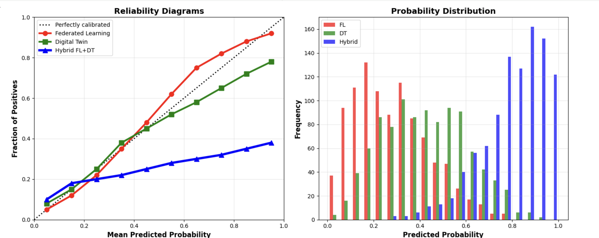

# Visualizations

## Hybrid Model Performance Comparison

This plot shows how the proposed hybrid federated learning model performs compared to the baseline approaches. You can clearly see the improvement across the key metrics, especially in terms of stability and reduced false positives.

## Client-Level Heterogeneity (Heatmap)

This heatmap reflects the variation across clients and highlights the non-IID nature of the data. The differences across distributions help explain why a hybrid strategy is more effective in this setting.
